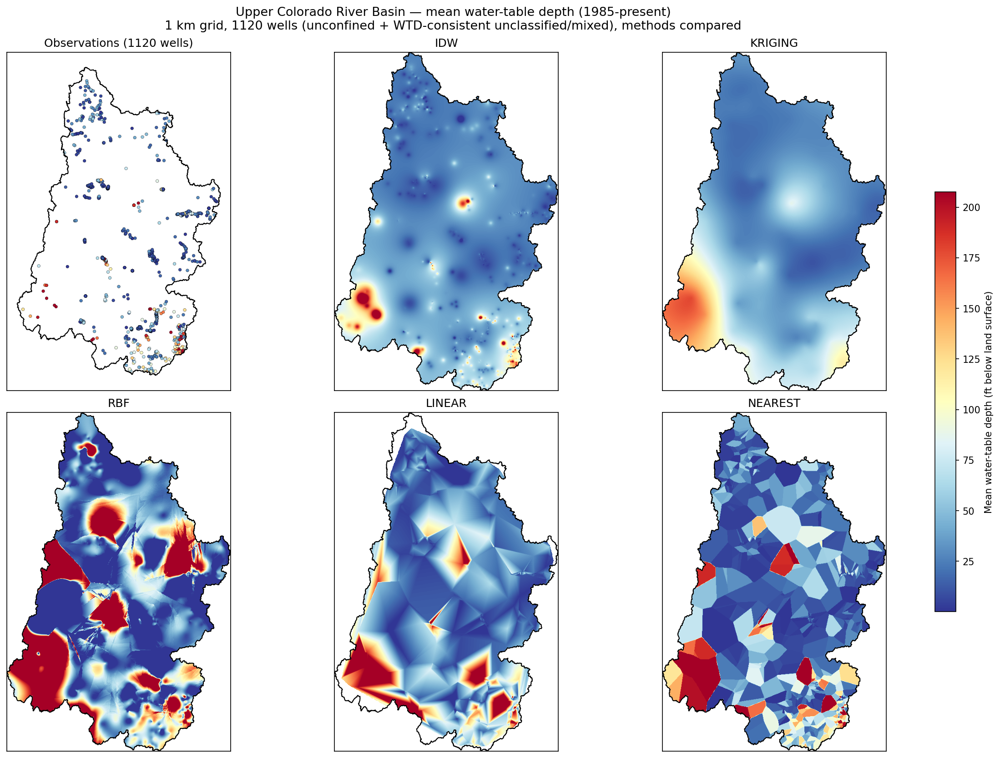
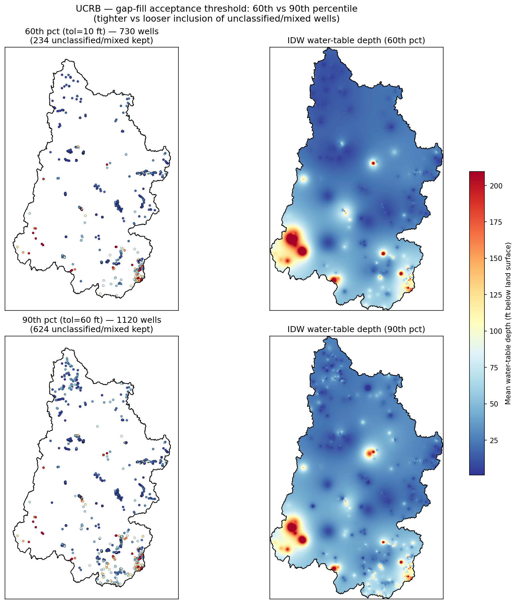

# Upper Colorado River Basin — Water-Table Depth Mapping

[`retrieve_ucrb.py`](retrieve_ucrb.py) builds a long-term **mean water-table
depth map** for the Upper Colorado River Basin (WBD HU2 = 14, ~293,570 km²
across AZ/CO/NM/UT/WY) from USGS groundwater observations, and compares several
spatial-interpolation methods.

It exercises most of pyGWRetrieval end to end:

- large-area retrieval from the **USGS Water Data OGC API** (native request
  chunking — the basin bounding box spans ~53 square degrees),
- **field measurements + daily values** (`gwlevels` + `dv`) since 1985,
- **aquifer-type filtering** (water-table depth is only meaningful for
  unconfined aquifers),
- a data-driven **gap-fill** of unclassified/mixed wells, and
- gridded **interpolation** (`WaterTableInterpolator`) with GeoTIFF output.

## Running it

```bash
cd examples/ucrc
python retrieve_ucrb.py                      # defaults: 1985-present, 1 km grid, 90th-pct gap-fill
python retrieve_ucrb.py --grid-size-m 500    # finer grid
python retrieve_ucrb.py --consistency-pct 60 # stricter gap-fill (fewer wells)
python retrieve_ucrb.py --help

# After retrieve_ucrb.py has produced output/, render the threshold comparison
# (reuses the downloaded data, no re-download):
python compare_thresholds.py --tight-pct 60 --loose-pct 90
```

> **Note**: a fresh run downloads data for the whole basin and can hit the
> anonymous USGS API rate limit (HTTP 429). Obtain a USGS API token or re-run
> later if that happens. `UCRB_WBDHU2.zip`/`UCRB_WBDHU2/` holds the basin
> shapefile; outputs are written to `output/`.

## The well funnel

| Step | Wells | Why |
|------|------:|-----|
| GW sites discovered in the basin | 12,239 | every groundwater site in the polygon |
| …that returned water-level data | 1,687 | the rest have no retrievable time series |
| …with depth-to-water (param `72019`) | 1,687 | all report depth to water |
| …confirmed **unconfined** (`aqfr_type_cd == 'U'`) | 496 | the water-table reference set |
| …after gap-filling unclassified/mixed (90th pct) | **1,120** | see below |

Only wells with **depth-to-water** measurements are used (parameter `72019`,
feet below land surface); wells reporting only water-level *elevation*
(`62610`/`62611`) are excluded so every point is on the same footing.

## Gap-filling the unclassified & mixed wells

Most sites (~1,034 here) have **no coded aquifer type**. Rather than discard
them, the example keeps a candidate only if its mean depth-to-water is
**consistent with the water-table surface defined by the confirmed unconfined
wells**:

1. Interpolate the unconfined wells with IDW and compute their **leave-one-out
   residuals** (`idw_at_points(..., leave_one_out=True)`) — this characterizes
   the water table's natural spatial variability.
2. Set the acceptance band to a percentile of those residuals
   (`--consistency-pct`, default 90 → ~60 ft).
3. Predict each unclassified/mixed well from the unconfined surface; **keep it
   if it falls within the band**. Confined wells are always excluded.

### Method comparison (1 km grid, 1,120 wells)



- **IDW** — smooth "bullseyes" around wells.
- **Kriging** (ordinary) — smooth geostatistical surface.
- **RBF** (thin-plate spline) — fits tightly but overshoots when extrapolating.
- **Linear** — Delaunay triangulation; only fills the convex hull of the wells
  (blank beyond it unless `fill_outside='nearest'` is set).
- **Nearest** — hard Voronoi cells.

### Threshold sensitivity (60th vs 90th percentile)

How inclusive should the gap-fill be? Tighter (60th) keeps only wells that hug
the unconfined surface; looser (90th) fills sparse areas at the cost of
admitting wells that deviate more. Rendered by
[`compare_thresholds.py`](compare_thresholds.py):



| Threshold | Tolerance | Unclassified/mixed kept | Total wells |
|-----------|----------:|------------------------:|------------:|
| 60th pct (tighter) | 10 ft | 234 | 730 |
| 90th pct (looser)  | 60 ft | 624 | 1,120 |

The **regional pattern is stable** across thresholds (broadly shallow water
table, a deep pocket in the southwest). The looser threshold mainly **densifies
coverage** in the sparsely-sampled north and center, resolving more local
structure. Choose with `--consistency-pct` based on how much you trust uncoded
wells where data are sparse.

## Outputs (`output/`)

| File | Description |
|------|-------------|
| `ucrb_gwl_1985_present.parquet` | all retrieved records (gwlevels + dv) |
| `ucrb_wells.geojson` | well locations with aquifer attributes |
| `ucrb_wtd_mean_<method>.tif` | interpolated water-table depth GeoTIFF per method |
| `wtd_methods_comparison.png` | five-method comparison figure |
| `wtd_threshold_comparison.png` | 60th-vs-90th-percentile gap-fill comparison |
